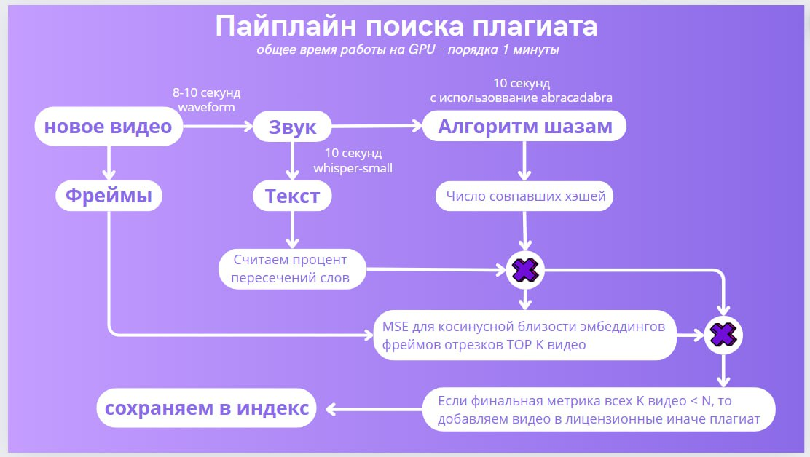
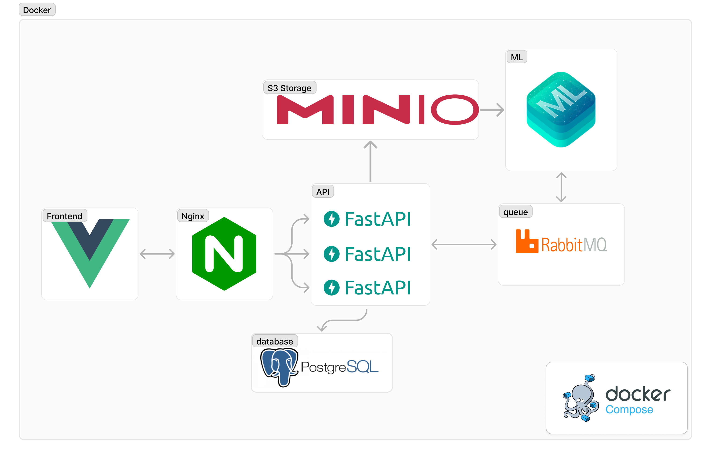

# Сервис проверки видеофайлов на нарушение авторских прав

## Основные функции
 - Проверка видеофайлов на наличие нарушений авторских прав.
 - Загрузка видео в базу лицензионных видео.

## Основная структура
hash.db - База Данных sqlite с хэшами алгоритма Shazam  
requirements.txt - необходимые библиотеки  
cache - папка для сохранения временных файлов  

scripts - скрипты для алгоритма Shazam  
--audio2text.py - Перевод аудио в текст  
--fingerprint.py - Cоздание "слепка" видео  
--recognise.py - Проверка видео на плагиат  
--storage.py - Скрипты для базы данных  


## Пайплайн поиска плагиата



## Архитектура



Проект построен на принципах микросервисной архитектуры с целью обеспечить надежность и дальнейшую масштабируемость.

### RabbitMQ
 - RabbitMQ является мощной и надежной системой обмена сообщениями. Она обеспечивает асинхронную коммуникацию между сервисами, что важно для построения отказоустойчивых и масштабируемых микросервисных архитектур.

### MinIO
 - MinIO предоставляет высокопроизводительное объектное хранилище, аналогичное Amazon S3, которое легко интегрируется с различными приложениями и поддерживает стандарты S3 API.

### PostgreSQL
 - PostgreSQL является одной из самых мощных и надежных реляционных баз данных с открытым исходным кодом.

### FastAPI
 - FastAPI используется для разработки бэкенда. Этот фреймворк обеспечивает высокую производительность и быструю разработку благодаря асинхронной архитектуре.

### Vue.js
 - Vue.js используется для создания фронтенда. Этот фреймворк обеспечивает динамичные и отзывчивые пользовательские интерфейсы с минимальной сложностью.

### REST API
 - REST API обеспечивает стандартизированный подход к построению веб-сервисов, что делает их легко доступными и интегрируемыми с различными клиентами и сервисами.

Выбор данных технологий обусловлен их надежностью, производительностью и удобством в использовании. FastAPI и Vue.js обеспечивают создание быстрого, масштабируемого и простого в поддержке приложения. Использование REST API и Swagger улучшает взаимодействие с API и облегчает интеграцию с другими системами. Использование Docker и Docker Compose упрощает процесс развертывания и управления многокомпонентной системой, обеспечивая консистентность среды и легкость масштабирования.

## Уставновка

1. Клонируйте репозиторий:
```shell
git clone git@github.com:ShadowP1e/lct-hackathon.git
```
2. Перейдите в папку проекта
```shell
cd lct-hackathon
```
3. Переименуйте файл .env.sample в .env
```shell
mv .env.sample .env
```
4. Запустите сервисы:
```shell
docker compose up --build
```

## Команда

Проект разработан командой Selling Pandas в рамках хакатона Лидеры цифровой трансформации.
